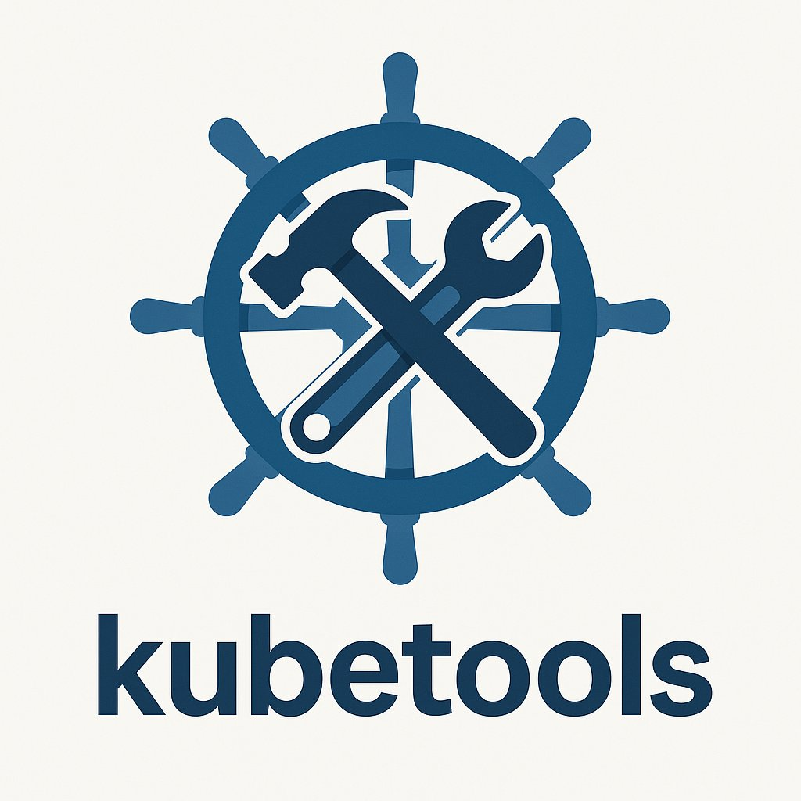

# kubetools





**kubetools** is a lightweight containerized DevOps toolkit designed for Kubernetes operators, SREs, and platform engineers. It combines essential CLI tools like `kubectl`, `helm`, `k9s`, `flux`, and more within a pre-configured shell environment, making it ideal for local or in-cluster use.

---

## ✨ Features

- Preinstalled Kubernetes tools: `kubectl`, `helm`, `krew`, `k9s`, `flux`, `velero`, `kubeseal`, and more
- Fully configured ZSH environment with powerlevel10k theme
- SSH and kubeconfig support
- GitHub Actions workflows for automated container rebuilds
- Ready-to-use Kubernetes manifests for in-cluster deployment

---

## 💡 Use Cases

- DevOps and platform engineering automation
- Cluster management shell in Kubernetes pods
- CI/CD pipelines
- Safe scripting environments for GitHub Actions or remote workstations

---

## 🚀 Quick Start

### Build the container image

```bash
# Clone the repository
git clone https://github.com/mrc-schbrt-oss/kubetools.git
cd kubetools

# Build with Docker or Podman
podman build -t kubetools .
# or
podman build -t kubetools .
```

### Run the container interactively

```bash
podman run --rm  -it docker.io/nerdyzonky/kubetools:latest zsh
```

### Mount kubeconfig and SSH keys

```bash
podman run --rm -v $HOME/kubetools/data:/root/data -it docker.io/nerdyzonky/kubetools:latest zsh
```
---

## 🏠 Kubernetes Deployment

### 1. PersistentVolumeClaim

```bash
kubectl apply -f manifest-examples/kubetools-pvc.yaml
```

### 2. Deployment

```bash
kubectl apply -f manifest-examples/kubetools-deployment.yaml
```

You can then `kubectl exec` into the running pod to use the toolset.

---

## 📁 Shell Configuration

The container includes a pre-configured ZSH environment:

### Files:

- `.zshrc`: loads plugins, aliases, and powerlevel10k
- `.zshenv`: general environment variables
- `p10k.zsh`: powerlevel10k theme config
- `ssh.conf`: used for custom SSH setup if needed

Sample features in `.zshrc`:

```zsh
alias k=kubectl
alias kgp='kubectl get pods'
alias kaf='kubectl apply -f'
```

---

## 🛠️ Included Tools (from Dockerfile)

- **Shell & Productivity:**
  - `zsh`, `powerlevel10k`, `byobu`
  - `bash`, `coreutils`, `findutils`, `file`
- **Kubernetes & Cloud:**
  - `kubectl`, `k9s`, `helm`, `flux`, `velero`, `kubeseal`, `krew`
- **Configuration & Automation:**
  - `ansible`, `yq`, `jq`, `gettext`, `envsubst`
- **Networking & SSH:**
  - `openssh-client`, `openssh`, `rsync`, `curl`, `wget`, `bind-tools`
- **Version Control:**
  - `git`, `gh` (GitHub CLI)
- **Archive & Packaging:**
  - `tar`, `gzip`, `unzip`
- **Scripting Base:**
  - `python3`, `py3-pip`, `make`, `nano`, `vim`, `less`, `grep`

All installed in a compact Alpine-based container.

---

## 💡 GitHub Actions

Two workflows are included:

### `.github/workflows/commit-push.yaml`

Auto-commit and push updated files.

### `.github/workflows/rebuild.yml`

Triggers image rebuild (e.g. via schedule or push).

---

## 📃 License

GPL-3.0 license

---

## 📢 Contributions

Issues and PRs are welcome!

---

## ✨ Maintainer

GitHub: [mrc-schbrt-oss](https://github.com/mrc-schbrt-oss)
