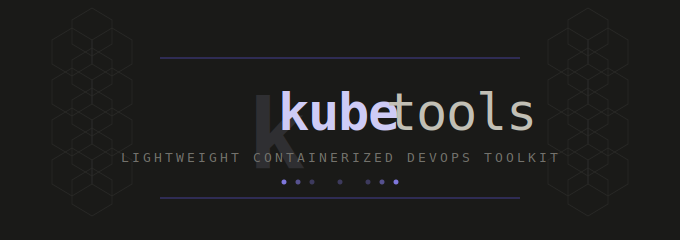
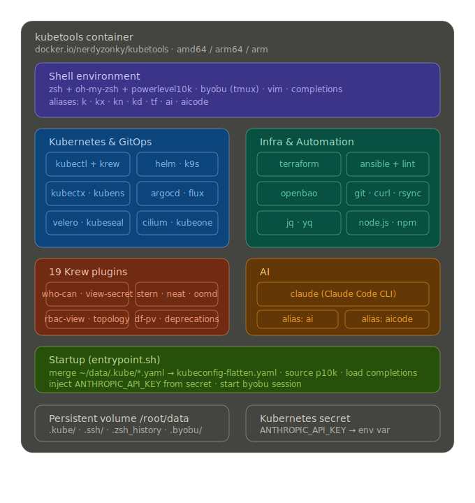

# kubetools





**kubetools** is a lightweight containerized DevOps toolkit designed for Kubernetes operators, SREs, and platform engineers. It packages a comprehensive set of CLI tools — from cluster management and GitOps to infrastructure-as-code and AI-assisted workflows — inside a pre-configured ZSH shell environment, ready for interactive use, CI/CD pipelines, or in-cluster deployment as a pod.

---

## ✨ Features

- **30+ CLI tools** preinstalled: `kubectl`, `helm`, `kubectx`/`kubens`, `k9s`, `argocd`, `flux`, `velero`, `kubeseal`, `cilium`, `kubeone`, `terraform`, `openbao`, `ansible`, `claude`, and more
- **Krew plugin manager** with 19 curated kubectl plugins pre-installed
- **Shell completions** auto-loaded for `kubectl`, `helm`, `argocd`, `flux`, `cilium`, and `kubeone`
- **Automatic kubeconfig merging** — all `~/data/.kube/*.yaml` files are merged and flattened on startup
- **ZSH environment** with oh-my-zsh, optional powerlevel10k theme, and useful Kubernetes aliases
- **SSH support** via configurable `ssh.conf` and persistent `~/data/.ssh/` directory
- **Persistent data directory** at `/root/data` — mount a volume here to persist kubeconfigs, SSH keys, shell history, and byobu sessions
- **Multi-arch builds** — supports `amd64`, `arm64`, and `arm`
- **GitHub Actions workflows** for automated container rebuilds

---

## 🏗️ Architecture



---

## 💡 Use Cases

- Interactive Kubernetes cluster management shell (local or in-cluster pod)
- Platform engineering and automation workflows
- CI/CD pipeline executor with pre-installed toolchain
- GitOps operations with Flux and ArgoCD
- Infrastructure provisioning with Terraform and Ansible
- AI-assisted workflows via Claude Code CLI

---

## 🚀 Quick Start

### Run from container registry

```bash
podman run --rm -it docker.io/nerdyzonky/kubetools:latest zsh
```

### Mount your kubeconfigs, SSH keys, and persistent data

```bash
podman run --rm \
  -v $HOME/kubetools/data:/root/data \
  -it docker.io/nerdyzonky/kubetools:latest zsh
```

The container expects kubeconfig files at `~/data/.kube/*.yaml`. On startup, all files are automatically merged into `~/data/.kube/kubeconfig-flatten.yaml` and set as `$KUBECONFIG`.

SSH keys and config are expected at `~/data/.ssh/`. Shell history is persisted at `~/data/.zsh_history`.

### Build from source

```bash
git clone https://github.com/mrc-schbrt-oss/kubetools.git
cd kubetools

docker build -t kubetools .
# or
podman build -t kubetools .
```

---

## 🏠 Kubernetes In-Cluster Deployment

### 1. Create a PersistentVolumeClaim

```bash
kubectl apply -f manifest-examples/kubetools-pvc.yaml
```

### 2. Deploy the pod

```bash
kubectl apply -f manifest-examples/kubetools-deployment.yaml
```

### 3. Open a shell

```bash
kubectl exec -it <pod-name> -- zsh
```

---

## 🛠️ Included Tools

### Kubernetes & Cluster Management

| Tool | Description |
|---|---|
| `kubectl` | Kubernetes CLI |
| `kubectx` | Switch between Kubernetes contexts |
| `kubens` | Switch between Kubernetes namespaces (bundled with kubectx) |
| `k9s` | Terminal UI for Kubernetes cluster management |
| `helm` | Kubernetes package manager |
| `krew` | kubectl plugin manager |
| `kubeseal` | Encrypt secrets for Sealed Secrets controller |
| `cilium` | Cilium CNI CLI for network policy and observability |
| `kubeone` | Cluster lifecycle management (provision, upgrade, repair) |

### GitOps

| Tool | Description |
|---|---|
| `flux` | Flux CD CLI for GitOps workflows |
| `argocd` | Argo CD CLI for GitOps deployments |
| `velero` | Backup and restore for Kubernetes resources and PVs |

### Infrastructure as Code & Automation

| Tool | Description |
|---|---|
| `terraform` | Infrastructure provisioning by HashiCorp |
| `ansible` | IT automation and configuration management |
| `ansible-lint` | Linter for Ansible playbooks and roles |
| `openbao` | Open-source HashiCorp Vault fork for secrets management |

### Data Processing & Scripting

| Tool | Description |
|---|---|
| `jq` | JSON processor |
| `yq` | YAML/JSON/TOML processor |

### Shell & Productivity

| Tool | Description |
|---|---|
| `zsh` | Z Shell |
| `bash` | Bash shell |
| `oh-my-zsh` | ZSH framework for plugins and themes |
| `zsh-theme-powerlevel10k` | Fast and flexible ZSH prompt theme |
| `byobu` | Terminal multiplexer (tmux-based) with persistent sessions |
| `vim` | Text editor (pre-configured with [amix/vimrc](https://github.com/amix/vimrc)) |

### Network & File Transfer

| Tool | Description |
|---|---|
| `curl` | HTTP/HTTPS client |
| `rsync` | File synchronization |
| `openssh-client` | SSH client |

### Version Control

| Tool | Description |
|---|---|
| `git` | Version control |

### Runtime & Utilities

| Tool | Description |
|---|---|
| `nodejs` / `npm` | JavaScript runtime and package manager |
| `go` | Go runtime (used for build-time tool compilation) |
| `tar` / `gzip` | Archive tools |
| `ca-certificates` | TLS certificate bundle |

### AI

| Tool | Description |
|---|---|
| `claude` | [Claude Code CLI](https://claude.ai/code) by Anthropic — AI-assisted coding and operations, installed via `npm install -g @anthropic-ai/claude-code` |

---

## 🔌 Krew Plugins (pre-installed)

The following `kubectl` plugins are installed via krew. Some are only available on `amd64` due to upstream limitations.

| Plugin | Description | amd64 | arm64/arm |
|---|---|:---:|:---:|
| `who-can` | Show who has RBAC permission to perform actions | ✅ | ✅ |
| `view-secret` | Decode and display Kubernetes secrets | ✅ | ✅ |
| `resource-capacity` | Show resource requests and limits per node/pod | ✅ | ✅ |
| `kubesec-scan` | Security risk analysis for Kubernetes resources | ✅ | ✅ |
| `sort-manifests` | Sort Kubernetes manifests by kind | ✅ | ✅ |
| `outdated` | Find outdated container images in the cluster | ✅ | ✅ |
| `status` | Show rollout status with detailed output | ✅ | ✅ |
| `stern` | Multi-pod log tailing | ✅ | ✅ |
| `oomd` | Show OOMKilled container events | ✅ | ❌ |
| `unused-volumes` | Find PVCs not mounted by any pod | ✅ | ❌ |
| `get-all` | Like `get all` but includes non-default resources | ✅ | ❌ |
| `neat` | Remove clutter from `kubectl get -o yaml` output | ✅ | ❌ |
| `topology` | Visualize node and pod topology | ✅ | ❌ |
| `pod-dive` | Explore a pod's workload tree | ✅ | ❌ |
| `deprecations` | Detect deprecated API versions in the cluster | ✅ | ❌ |
| `rbac-view` | Visual RBAC explorer | ✅ | ❌ |
| `rbac-lookup` | Look up roles bound to users, groups, or service accounts | ✅ | ❌ |
| `access-matrix` | Show access matrix for Kubernetes resources | ✅ | ❌ |
| `df-pv` | Show PersistentVolume disk usage | ✅ | ❌ |

---

## 📁 Shell Configuration

### Aliases

```zsh
alias k=kubectl        # kubectl shorthand
alias kx=kubectx       # switch cluster context
alias kn=kubens        # switch namespace
alias kd=kubectl-view_secret  # decode secrets
alias tf=terraform     # terraform shorthand
```

### Shell completions

Tab completions are auto-loaded on startup for:
`kubectl`, `flux`, `argocd`, `helm`, `cilium`, `kubeone`

### Kubeconfig handling

On every shell start, all `*.yaml` files in `~/data/.kube/` are merged and written to `~/data/.kube/kubeconfig-flatten.yaml`. This allows placing multiple cluster configs in the data directory without manual merging.

### Powerlevel10k theme (optional)

The powerlevel10k binaries are installed. To activate a custom prompt, place a theme config at `~/data/.p10k.zsh` — it will be sourced automatically on the next shell start.

### Config files in the repository

| File | Destination | Purpose |
|---|---|---|
| `zshrc-default.zsh` | `/etc/zsh/zshrc.d/` | Default shell config (aliases, completions, kubeconfig) |
| `zshenv` | `/etc/zsh/zshenv` | ZSH environment variables |
| `ssh.conf` | `/etc/ssh/ssh_config.d/` | SSH client defaults |
| `p10k.zsh` | (reference only) | Example powerlevel10k config |

---

## 📂 Data Directory Layout

Mount a persistent volume at `/root/data` to preserve state across container restarts:

```
/root/data/
├── .kube/                       # kubeconfig files (all *.yaml merged on startup)
│   └── kubeconfig-flatten.yaml  # auto-generated merged config
├── .ssh/                        # SSH keys and config
│   └── known_hosts.d/
├── .p10k.zsh                    # optional powerlevel10k theme config
├── .zsh_history                 # persistent shell history
└── .byobu/                      # byobu/tmux session config
```

---

## 💡 GitHub Actions

### `.github/workflows/commit-push.yaml`

Auto-commits and pushes updated files (e.g. after automated changes).

### `.github/workflows/rebuild.yml`

Triggers an image rebuild on push or schedule, ensuring the container always ships the latest tool versions (since most tools are fetched at build time via the GitHub API).

---

## 📃 License

GPL-3.0 — see [LICENSE](./LICENSE)

---

## 📢 Contributions

Issues and PRs are welcome!

---

## ✨ Maintainer

GitHub: [mrc-schbrt-oss](https://github.com/mrc-schbrt-oss)
